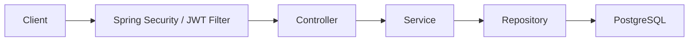
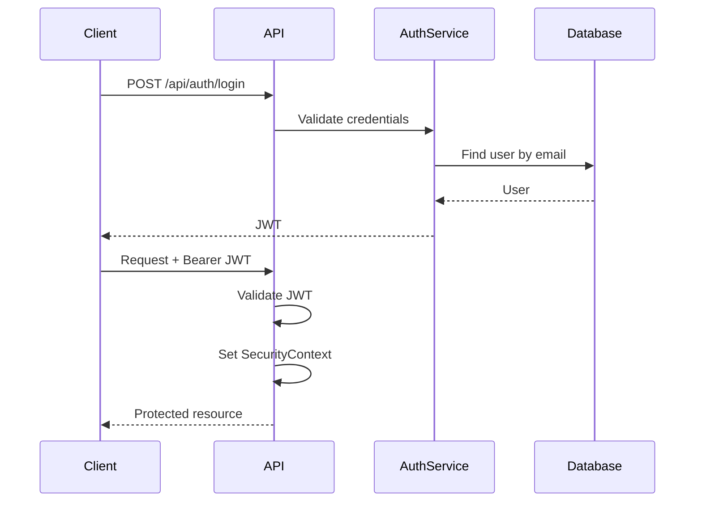

# PatAPet

PatAPet is an in-development pet-sharing platform designed to connect pet lovers with pets nearby.

The project is built with **Java and Spring Boot**, with a focus on backend architecture, authentication, API security, relational data modelling, and containerised local development.

The current version implements **JWT-based user authentication** and **pet profile management**. Booking, listing, and payment workflows are planned for future development.

---

## Current Features

### Authentication

- User registration and login
- BCrypt password hashing
- Stateless JWT authentication
- JWT signature and expiration validation
- Protected API endpoints using Spring Security
- User identity and role stored in the JWT security context

### Pet Management

Authenticated users can:

- Create pet profiles
- Retrieve their own pets
- Update pet information
- Delete pet profiles
- Manage pet attributes including:
  - Name
  - Breed
  - Weight
  - Photo URL
  - Tags

Update and delete operations include ownership checks to prevent users from modifying pets that belong to another account.

---

## Tech Stack

### Backend

- Java 17
- Spring Boot 3
- Spring Web
- Spring Security
- Spring Data JPA
- Hibernate
- Jakarta Validation

### Database

- PostgreSQL 15
- PostGIS
- UUID primary keys
- JPA entity relationships

### Authentication

- JSON Web Tokens (JWT)
- JJWT
- BCrypt

### Development & Tooling

- Docker
- Docker Compose
- Maven
- Swagger / OpenAPI
- Lombok

---

## Architecture

PatAPet follows a layered backend architecture:



### Application Layers

**Controller Layer**

Handles HTTP requests and responses and exposes REST API endpoints.

**Service Layer**

Contains business logic, authorization checks, and transaction management.

**Repository Layer**

Uses Spring Data JPA to communicate with PostgreSQL.

**Security Layer**

Validates JWT tokens and stores authenticated user information in Spring Security's `SecurityContext`.

---

## Authentication Flow



After registration or login, the API returns a JWT containing the user's ID and role.

Protected requests use:

```http
Authorization: Bearer <token>
```

---

## API Endpoints

### Authentication

| Method | Endpoint | Authentication | Description |
| --- | --- | --- | --- |
| `POST` | `/api/auth/register` | No | Register a new user |
| `POST` | `/api/auth/login` | No | Log in and receive a JWT |

### Pets

| Method | Endpoint | Authentication | Description |
| --- | --- | --- | --- |
| `POST` | `/api/pets` | Required | Create a pet profile |
| `GET` | `/api/pets/me` | Required | Retrieve the authenticated user's pets |
| `PUT` | `/api/pets/{petId}` | Required | Update a pet profile |
| `DELETE` | `/api/pets/{petId}` | Required | Delete a pet profile |

---

## Running Locally

### Prerequisites

Make sure you have installed:

- Java 17+
- Docker
- Docker Compose

The repository includes the Maven Wrapper, so a separate Maven installation is not required.

### 1. Clone the repository

```bash
git clone https://github.com/hsiao0207/PatAPet.git
cd PatAPet
```

### 2. Start PostgreSQL

```bash
docker compose up -d
```

Docker Compose starts the PostgreSQL/PostGIS database and automatically runs `init.sql` when the database volume is first created.

The local database is exposed on:

```text
localhost:5433
```

### 3. Start the Spring Boot application

macOS / Linux:

```bash
./mvnw spring-boot:run
```

Windows:

```bash
mvnw.cmd spring-boot:run
```

The API will start on:

```text
http://localhost:8080
```

---

## API Documentation

Swagger UI is available while the application is running:

```text
http://localhost:8080/swagger-ui/index.html
```

The OpenAPI specification is available at:

```text
http://localhost:8080/v3/api-docs
```

Swagger can be used to test registration and login, obtain a JWT, authorize requests, and interact with the protected pet APIs.

---

## Project Structure

```text
src/main/java/com/patapet
│
├── controller
│   ├── AuthController
│   └── PetController
│
├── service
│   ├── AuthService
│   └── PetService
│
├── repository
│
├── entity
│   ├── User
│   └── Pet
│
├── dto
│
└── security
    ├── SecurityConfig
    ├── JwtFilter
    └── JwtTokenProvider
```

---

## Database

The development database runs in Docker using PostgreSQL with PostGIS support.

The application uses:

- UUID-based primary keys
- JPA / Hibernate entity mapping
- One-to-many relationships between users and pets
- PostgreSQL enum types
- PostgreSQL array fields for pet tags
- Persistent Docker volumes

Hibernate is configured with:

```yaml
ddl-auto: validate
```

so the application validates its JPA entities against the database schema instead of automatically modifying the schema.

---

## Roadmap

PatAPet is actively under development.

Planned features include:

- [x] User registration and login
- [x] JWT authentication
- [x] Pet profile management
- [x] Ownership-based pet authorization
- [x] Swagger / OpenAPI documentation
- [ ] Owner profile management
- [ ] Pet service listings
- [ ] Booking workflow
- [ ] Availability management
- [ ] Payment integration
- [ ] Location-based pet service discovery
- [ ] Automated backend testing
- [ ] Cloud deployment

---

## Project Status

**In active development**

The current development focus is building the backend foundation and core domain features before implementing the complete booking workflow.