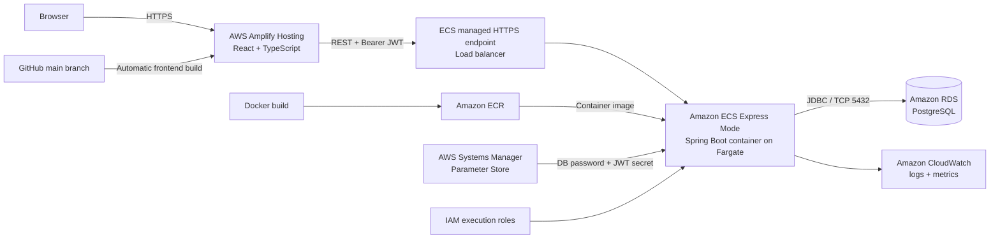
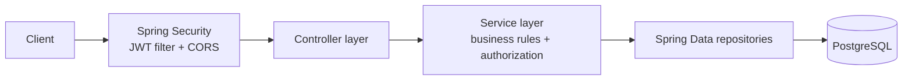
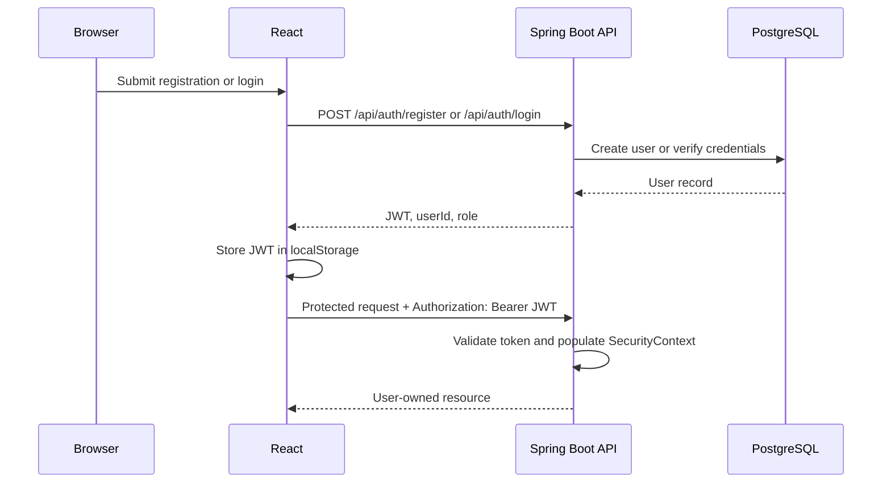

# PatAPet

PatAPet is a full-stack pet profile and pet-service platform built with React, TypeScript, Spring Boot, and PostgreSQL. The current release provides a complete authentication-to-pet-management flow and is deployed on AWS.

The project demonstrates REST API design, stateless JWT security, ownership-based authorization, relational data modelling, database migrations, containerisation, cloud deployment, and frontend/backend integration.

## Live Deployment

| Service | URL |
| --- | --- |
| React application | [Open PatAPet](https://main.d3d9e059cppvz7.amplifyapp.com) |
| Swagger UI | [Open API documentation](https://pa-670535c0c36247ea84e3a8f7759bf5a9.ecs.ap-southeast-2.on.aws/swagger-ui/index.html) |
| Health check | [View API health](https://pa-670535c0c36247ea84e3a8f7759bf5a9.ecs.ap-southeast-2.on.aws/actuator/health) |

The API root is protected and returns `403 Forbidden` by design. Use Swagger UI, the health endpoint, or the React application to access the deployed system.

> The live environment may be paused outside demonstration periods to control AWS costs.

## Current Features

### User authentication

- User registration and login
- BCrypt password hashing
- Stateless JWT authentication
- JWT signature and expiration validation
- Role and user ID claims stored in the JWT
- Automatic frontend logout when an authenticated request returns `401`
- Request validation and consistent JSON error responses

### Pet profile management

Authenticated users can:

- Create pet profiles
- Retrieve their own pets
- Update pet information through the REST API
- Delete pet profiles
- Store a pet's name, breed, weight, photo URL, and tags
- Automatically classify pets as `SMALL`, `MEDIUM`, or `LARGE` from their weight

Update and delete operations verify ownership in the service layer, preventing one user from modifying another user's pets.

### React frontend

- Registration and login pages
- Protected client-side routes
- Pet dashboard with create, list, and delete operations
- Shared typed HTTP client for API base URL, JSON handling, JWT headers, and backend errors
- Responsive styling and SPA routing

### Platform and operations

- Dockerised Spring Boot application using a multi-stage build
- Docker Compose development environment for the API and PostgreSQL/PostGIS
- Persistent local database volume and container health checks
- Flyway-controlled database schema
- Separate production Spring profile
- Configurable CORS allowlist
- Spring Boot Actuator health endpoint
- Swagger/OpenAPI documentation
- AWS-hosted frontend, API, and database
- CloudWatch logs and infrastructure metrics

## Architecture



### AWS deployment

The production environment runs in the `ap-southeast-2` region:

- **AWS Amplify Hosting** builds and hosts the React application from the `main` branch.
- **Amazon ECR** stores the backend Docker image.
- **Amazon ECS Express Mode** runs the Spring Boot container on AWS Fargate and provides managed HTTPS ingress.
- **Amazon RDS for PostgreSQL** provides the production database.
- **AWS Systems Manager Parameter Store** stores the database password and JWT secret.
- **AWS IAM** grants the ECS task execution role permission to pull images, publish logs, and retrieve parameters.
- **Amazon CloudWatch** collects application logs and infrastructure metrics.
- **Security groups** restrict PostgreSQL access to traffic from the application service.

Frontend deployment is continuous through Amplify. Backend image build and ECS deployment are currently manual; automated backend CI/CD is on the roadmap.

## Application Design

The backend follows a layered architecture:



### Authentication flow



## Technology Stack

| Area | Technologies |
| --- | --- |
| Frontend | React 19, TypeScript, Vite, React Router, native Fetch API, ESLint |
| Backend | Java 17, Spring Boot 3.3, Spring Web, Spring Security, Spring Data JPA, Hibernate, Jakarta Validation |
| Authentication | JWT (JJWT), BCrypt, stateless Spring Security |
| Database | PostgreSQL 15, PostGIS, Flyway, HikariCP |
| API documentation | Springdoc OpenAPI, Swagger UI |
| Local development | Docker, Docker Compose, Maven Wrapper, npm |
| AWS | Amplify Hosting, ECR, ECS Express Mode/Fargate, RDS, Parameter Store, IAM, CloudWatch |

## Repository Structure

```text
PatAPet/
├── frontend/                         # React and TypeScript SPA
│   ├── src/
│   │   ├── api/                      # Shared HTTP client and API modules
│   │   ├── auth/                     # JWT storage helpers
│   │   ├── components/               # Protected route component
│   │   ├── pages/                    # Login, registration, and pets pages
│   │   └── types/                    # TypeScript request/response types
│   ├── package.json
│   └── vite.config.ts
├── src/main/java/com/patapet/
│   ├── controller/                   # REST controllers
│   ├── dto/                          # Request and response models
│   ├── entity/                       # JPA entities
│   ├── exception/                    # Global API exception handling
│   ├── repository/                   # Spring Data repositories
│   ├── security/                     # JWT and Spring Security configuration
│   └── service/                      # Business logic and authorization
├── src/main/resources/
│   ├── db/migration/                 # Flyway migrations
│   └── application.yml               # Local and production configuration
├── Dockerfile                        # Multi-stage backend image
├── docker-compose.yml                # Local API and database environment
├── amplify.yml                       # Amplify frontend build configuration
├── .env.example                      # Local environment template
└── pom.xml                           # Maven dependencies and build configuration
```

## API Reference

### Authentication

| Method | Endpoint | Authentication | Description |
| --- | --- | --- | --- |
| `POST` | `/api/auth/register` | Public | Create an account and receive a JWT |
| `POST` | `/api/auth/login` | Public | Verify credentials and receive a JWT |

Registration request example:

```json
{
  "email": "user@example.com",
  "password": "secure-password",
  "fullName": "Example User"
}
```

Authentication response example:

```json
{
  "token": "<jwt>",
  "userId": "<uuid>",
  "role": "PATTER"
}
```

### Pets

| Method | Endpoint | Authentication | Description |
| --- | --- | --- | --- |
| `POST` | `/api/pets` | Bearer JWT | Create a pet profile |
| `GET` | `/api/pets/me` | Bearer JWT | Retrieve the authenticated user's pets |
| `PUT` | `/api/pets/{petId}` | Bearer JWT | Update an owned pet profile |
| `DELETE` | `/api/pets/{petId}` | Bearer JWT | Delete an owned pet profile |

Pet request example:

```json
{
  "name": "Milo",
  "breed": "Cavoodle",
  "weightKg": 8.5,
  "photoUrl": "https://example.com/milo.jpg",
  "tags": ["Friendly", "Playful"]
}
```

Protected requests require:

```http
Authorization: Bearer <token>
```

## Running Locally

### Prerequisites

- Docker Desktop with Docker Compose
- Node.js and npm for the frontend
- Git

Java and Maven do not need to be installed when the backend is run with Docker. The Maven Wrapper is included for running the backend directly.

### 1. Clone the repository

```bash
git clone https://github.com/hsiao0207/PatAPet.git
cd PatAPet
```

### 2. Configure local secrets

Copy the example environment file:

```bash
cp .env.example .env
```

Replace the placeholder values in `.env`. Use a random JWT secret of at least 32 characters:

```dotenv
POSTGRES_DB=patapet_db
POSTGRES_USER=patapet
POSTGRES_PASSWORD=replace-with-a-local-password
JWT_SECRET=replace-with-at-least-32-random-characters
```

Stripe values are currently placeholders for a future payment integration and are not required for the implemented user and pet flows.

Never commit `.env` or real credentials to Git.

### 3. Start the API and database

```bash
docker compose up --build
```

Docker Compose will:

1. Start PostgreSQL/PostGIS.
2. Wait for the database health check.
3. Build and start the Spring Boot API.
4. Run the Flyway migration automatically.
5. Persist PostgreSQL data in the `postgres_data` Docker volume.

Local backend endpoints:

- API: <http://localhost:8080>
- Swagger UI: <http://localhost:8080/swagger-ui/index.html>
- OpenAPI JSON: <http://localhost:8080/v3/api-docs>
- Health check: <http://localhost:8080/actuator/health>
- PostgreSQL: `localhost:5433`

### 4. Start the frontend

Open another terminal:

```bash
cd frontend
npm ci
```

Create `frontend/.env.local`:

```dotenv
VITE_API_BASE_URL=http://localhost:8080
```

Then start Vite:

```bash
npm run dev
```

Open <http://localhost:5173>.

### 5. Stop the local environment

```bash
docker compose down
```

This keeps the database volume. To deliberately remove all local database data as well, run `docker compose down -v`.

## Configuration

### Backend and Docker Compose

| Variable | Required | Purpose |
| --- | --- | --- |
| `POSTGRES_DB` | Local Docker | PostgreSQL database name |
| `POSTGRES_USER` | Local Docker | PostgreSQL username |
| `POSTGRES_PASSWORD` | Local Docker | PostgreSQL password |
| `JWT_SECRET` | Yes | HS256 signing key; use at least 32 random characters |
| `STRIPE_SECRET_KEY` | Not yet | Reserved for future Stripe integration |
| `STRIPE_WEBHOOK_SECRET` | Not yet | Reserved for future Stripe webhooks |

### Production backend

| Variable | Purpose |
| --- | --- |
| `SPRING_PROFILES_ACTIVE=prod` | Activates production overrides |
| `SPRING_DATASOURCE_URL` | RDS JDBC URL, for example `jdbc:postgresql://<endpoint>:5432/patapet_db` |
| `SPRING_DATASOURCE_USERNAME` | RDS database username |
| `SPRING_DATASOURCE_PASSWORD` | RDS password, supplied from Parameter Store in production |
| `JWT_SECRET` | JWT signing key, supplied from Parameter Store in production |
| `CORS_ALLOWED_ORIGINS` | Comma-separated trusted frontend origins |

### Frontend

| Variable | Purpose |
| --- | --- |
| `VITE_API_BASE_URL` | Base URL of the Spring Boot API; embedded at frontend build time |

## Database and Migrations

Flyway owns the database schema. On application startup, it runs pending scripts from `src/main/resources/db/migration` before Hibernate validates the entity mappings.

The initial migration creates:

- `users`
- `owner_profiles`
- `pets`
- `listings`
- `bookings`
- PostgreSQL enum types
- PostGIS, `uuid-ossp`, and `btree_gist` extensions
- Indexes and constraints, including prevention of overlapping listings for the same pet

Hibernate uses `ddl-auto: validate`, so application startup fails if the JPA model and database schema do not match. Owner profile, listing, and booking tables are prepared for later features; their complete API workflows are not yet implemented.

## Build and Verification

### Backend

```bash
./mvnw clean package
```

This verifies that the Spring Boot application compiles and can be packaged as an executable JAR. Backend test dependencies are configured in Maven, but automated backend tests have not yet been implemented.

### Frontend

```bash
cd frontend
npm ci
npm run lint
npm run build
```

The frontend includes an ESLint configuration and an `npm run lint` script. The production build runs TypeScript compilation before Vite creates the `dist` output. Amplify currently runs `npm run build`, but it does not run ESLint automatically.

Frontend unit and integration tests have not yet been implemented. Automated backend and frontend test coverage remains an explicit roadmap item.

## Deployment Workflow

### Frontend

1. A commit is pushed to `main` on GitHub.
2. Amplify reads `amplify.yml`.
3. Amplify runs `npm ci` and `npm run build` inside `frontend/`.
4. The generated `frontend/dist` assets are published to Amplify Hosting.
5. SPA rewrite rules route client-side paths such as `/login` and `/pets` to `index.html`.

### Backend

1. Build the multi-stage Docker image for the target Linux architecture.
2. Tag and push the image to Amazon ECR.
3. Deploy the image through ECS Express Mode.
4. ECS retrieves secrets from Parameter Store using its task execution role.
5. The Spring Boot production profile connects to RDS and Flyway validates/applies migrations.
6. The API exposes `/actuator/health` for service health checks, while logs and metrics are available in CloudWatch.

## Security Notes

- Passwords are stored as BCrypt hashes, never plaintext.
- JWT signing secrets and database passwords are not committed to the repository.
- Production secrets are retrieved from AWS Systems Manager Parameter Store.
- The backend is stateless and does not create server-side sessions.
- CORS accepts only configured frontend origins.
- Pet update and delete operations enforce owner identity.
- The database security group accepts PostgreSQL traffic from the application security group rather than the public internet.
- The container runs as a non-root Linux user.

For this demonstration frontend, the JWT is stored in `localStorage`. A future production hardening pass would evaluate short-lived access tokens and secure, `HttpOnly` refresh cookies.

## Roadmap

- [x] User registration and login
- [x] JWT authentication and protected routes
- [x] Pet profile REST API
- [x] Ownership-based pet authorization
- [x] React and TypeScript frontend
- [x] Flyway schema migrations
- [x] Docker Compose local environment
- [x] Swagger/OpenAPI documentation
- [x] AWS deployment with Amplify, ECR, ECS, RDS, Parameter Store, and CloudWatch
- [ ] Automated backend and frontend tests
- [ ] GitHub Actions backend CI/CD with AWS OIDC
- [ ] Pet photo upload with Amazon S3
- [ ] Owner profile and approval workflow
- [ ] Pet service listings and availability
- [ ] Booking workflow
- [ ] Stripe payment integration
- [ ] Location-based service discovery

## Author

Developed by [@hsiao0207](https://github.com/hsiao0207).
